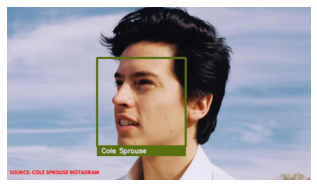
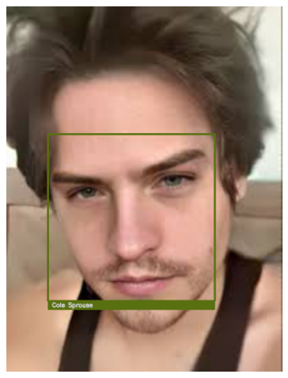
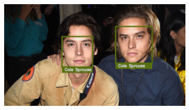
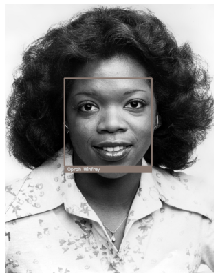
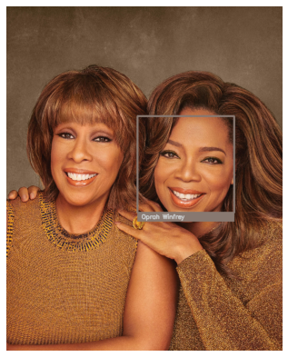

## Face Recognition in images

**Face Identification:** Spotting a human face in an image.  
**Face Recognition:** Determining which individual the face belongs to. 

TL;DR: In this project, we use the image recognition functionality in the 'face-recognition' python library. We feed an unknown facial image to program and it learns to identify the face in other images.

**Steps:**  
1) Capture the face encodings of Known images.  
2) Capture the face encodings of the Unknown images.  
3) Compare the two and check whether the known image encodings are similar to those of images with unknown faces.

I played around with the images a little bit. I tried to test if the library correctly distinguishes between identical twins. What about with Sunglasses on? 
Does it work on a photo of the same person taken 20 years ago?

### Result images:

  Cole Sprouse identified.  
  Cole's twin brother is identified as Cole.   
  Elon Musk, check!  
  Twins or Clones?  
  Sunglasses don't work. This was expected.  
  Young Oprah is identified without incident.  
  Oprah is correctly identified in a picture with her friend.  

I played around with the Tolerance setting (which adjusts the strictness of face ID).
As is commanly suggested, 0.6 was indeed the best setting. Even on changing Tolerance the setting to a stricter value (0.5, 0.4 and so on), the library was not able to distinguish between the twins, and the results were way off in general. 

#### Instructions for running
1) Open the 'face-recognition.ipynb' in google colab by clicking the 'Open in Colab' badge.
1) Upload the images.zip to in the files section in the leftmost pane.
2) Run all cells by clicking "Runtime >> Run" all from the file menu.
